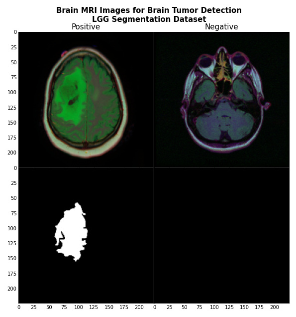
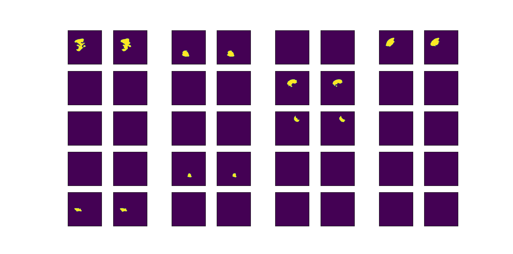
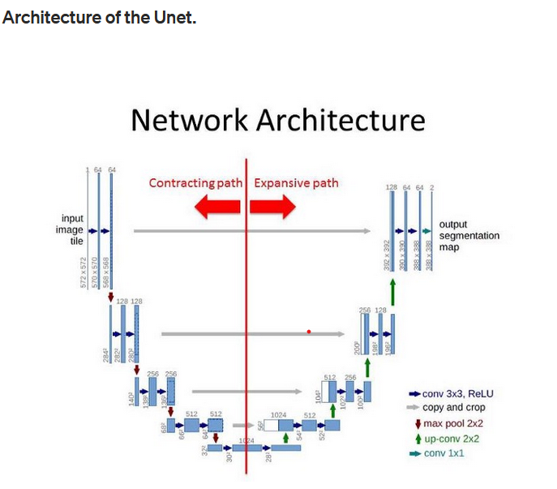

# DL_Project_CS : Brain MRI classification and segmentation

This project is part of a Deep Learning course in AI major at CentraleSupélec.
We used pytorch deep learning framework.

## Clone repository

```sh
$ git clone https://github.com/MarionSauvage/DL_Project_CS.git
```

## Dataset download
Data hosted on kaggle : https://www.kaggle.com/mateuszbuda/lgg-mri-segmentation

This dataset contains brain MR images together with manual FLAIR abnormality segmentation masks.
The images were obtained from The Cancer Imaging Archive (TCIA).
They correspond to 110 patients included in The Cancer Genome Atlas (TCGA) lower-grade glioma collection with at least fluid-attenuated inversion recovery (FLAIR) sequence and genomic cluster data available.
Tumor genomic clusters and patient data is provided in data.csv file.
There is no API. It has to be uploaded manually.
The dataset should be located outside this repo, with the following directory architecture:

``` bash 
├── dataset_mri
│   └── lgg-mri-segmentation
│       └── kaggle_3m 
└── DL_Project_CS (a.k.a this repo)
```

<div style="text-align:center"></div>


## Repository structure

``` bash 
├── README.md
├── classification
│   ├── classification.py
│   ├── classification_optimization.py
│   ├── model_classification.py
│   └── preprocessing_classification.py
│── images
│   ├── dataset.png
│   ├── predictions.png
│   └── unet_archi.png 
│── models
│   ├── unet_model.pt
│   └── unetresnet_model.pt    
├── segmentation
│   ├── preprocessing_segmentation.py
│   ├── model_segmentation.py
│   ├── result_display.py
│   └── segmentation.py
├── segmentation_kmeans
│   ├── preprocessing_segmentation.py
│   ├── model_segmentation.py
│   ├── result_display.py
│   └── segmentation.py
├── data_visualization.ipynb
├── main_classification.py
├── main_segmentation.py
├── main_segmentation_kmeans.py
├── main_output_display.py
├── preprocessing.py
├── requirements.txt
└── .gitignore
```

* In the **root** directory, we have :
   - `preprocessing.py` which is used to process the dataset before applying classification or segmentation codes. 
    - There is as well a `data_vizualisation.ipynb`, a jupyter notebook allowing to get a better understanding of the dataset.
    - There 2 main files `main_classification.py`and `main_segmentation.py` which respectively allow to perform classification and segmentation on the dataset.
    - `requirements.txt` that contains the libraries needed to run the code

* In the **images** directory, one finds the images present in the README.

* In the **models** directory, one finds :
    - `` unet_model.pt`` : saved model for 'UNET
    -  ``unetresnet_model.pt``  : saved model for 'UnetResnet'

* In **classification** directory :
    - ``classification.py`` : train and validation functions for the network
    - ``classification_optimization.py`` : function to optimize hyperparameters 
    - ``model_classification.py`` : model architecture (CNN)
    - ``preprocessing_classification.py`` : preprocessing to obtain a pytorch formated dataset for training

* In **segmentation** directory :
    - ``preprocessing_segmentation.py`` :  preprocessing to obtain a pytorch formated dataset for training with masks 
    - ``model_segmentation.py`` : models architecture (U-Nets)
    - ``result_display.py`` : function to display predictions 
    - ``segmentation.py`` : train and validation functions for the network

* In **segmentation_kmeans** directory :
    - ``preprocessing_segmentation.py`` :  preprocessing to obtain a pytorch formated dataset for training with masks 
    - ``model_segmentation.py`` : models architecture (U-Nets)
    - ``result_display.py`` : function to display predictions 
    - ``segmentation.py`` : train and validation functions for the network

## Computer vision approach

- ``skull_stripping.ipynb`` : notebook showing our work on skull stripping and images preprocessing
- ``segmentation_kmeans.ipynb`` : notebook describing k-means segmentation experiments 

## Requirements 

The file ``requirements.txt`` in the root directory contains the list of libraries needed to run our code. You can install them using the command ``pip install -r requirements.txt``.

## How tu run models with saved models

- Unet
Excute : ``python ./main_output_display.py --model Unet``

- UnetResnet 
Excute : ``python ./main_output_display.py --model UnetResNet``
## Outputs

Reference mask and predictions for 20 examples: 
<div style="text-align:center"></div> 


## How to run the training files for classification and segmentation

* main_classification.py :
    - Execute : ``python ./main_classification.py --mode [mode]``
    - ``mode`` being one of the following
        + ``basic``: standard training and test set evaluation
        + ``optimizer_optimization``: optimization of the optimizer learning rate and momentum
        + ``nn_layers_optimization``: optimization of the convolutional and fully connected layers
* main_segmentation.py :
    - Execute : ``python ./main_segmentation.py --mode [mode] --model [model] --epochs [epochs] --early-stopping [early-stopping] --nb_splits [nb_splits] --lr [lr] --display_predictions --save_model``
    - ``mode``: choose wether you want to perform basic training, learning rate comparison, batch size testing or k-fold cross validation
    - ``model`` being either ``Unet`` or ``UnetResNet``, depending on the model you want to train
    - ``epochs``: number of epochs to train
    - ``early-stopping``: number of epochs without loss improvement
    - ``nb_splits``: number of splits for k-fold cross validation
    - ``lr``: learning rate for the training
    - ``display_predictions``: Display or not predictions on the testing set. Only with ``basic`` mode
    - ``save_model``: Save or not the trained model. Only with ``basic`` mode


## Models
 
* for classification we used a convolutional neural network (CNN) 

* for segmentation we used a UNET architecture described below 

<div style="text-align:center">


Source : https://becominghuman.ai/implementing-unet-in-pytorch-8c7e05a121b4 </div> 


