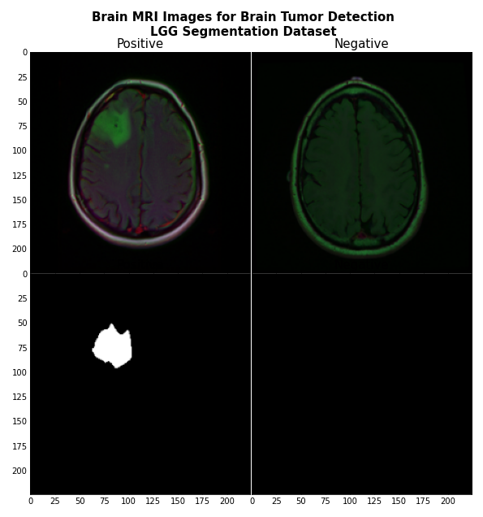

# DL_Project_CS : Brain MRI classification and segmentation

This project is part of a Deep Learning course in AI major at CentraleSupélec.

## Clone repository

## Dataset download
Data hosted on kaggle : https://www.kaggle.com/mateuszbuda/lgg-mri-segmentation

This dataset contains brain MR images together with manual FLAIR abnormality segmentation masks.
The images were obtained from The Cancer Imaging Archive (TCIA).
They correspond to 110 patients included in The Cancer Genome Atlas (TCGA) lower-grade glioma collection with at least fluid-attenuated inversion recovery (FLAIR) sequence and genomic cluster data available.
Tumor genomic clusters and patient data is provided in data.csv file.

There is no API. It has to be uplaod manually.

## Repository structure

## Requirements 

Segmentation with UNET architecture

Source : https://becominghuman.ai/implementing-unet-in-pytorch-8c7e05a121b4
